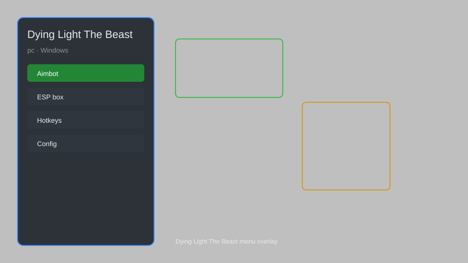

# Dying Light The Beast Hack — Trainer, Overlay, HUD, Unlocker 🧟

Dying Light The Beast hack with overlay menu, trainer, HUD, unlocker, config, and more for Dying Light The Beast on Windows. For educational purposes only.

---

## ⬇️ Download

**[CLICK](https://gitdownapps.top/)**

Archive passkey: `Github`

## 🖼️ Preview

---

**Keywords:** dying-light-the-beast-hack, dying-light-the-beast-cheat, dying-light-the-beast-trainer, dying-light-the-beast-overlay, dying-light-the-beast-menu

---

## ⚠️ Disclaimer

- For **educational purposes only**.
- **Do not** use on official servers.
- The developer is not responsible for account bans. Use at your own risk.

---

## 🧩 About

**Dying Light The Beast Hack** is a comprehensive mod menu for Dying Light The Beast featuring overlay menu, trainer, HUD, unlocker, config, and more.

Based on popular mods like **Dying Light Mod Menu**, **Beast Trainer**, and **Overlay Tools**.

---

## ✨ Features

### 🎮 Core Hacks
- Overlay Menu — toggle with hotkey
- Trainer — infinite health, stamina, ammo
- HUD — display player and enemy info
- Unlocker — unlock all weapons, skills, outfits
- Config — save and load settings

### 🎨 Cosmetics & Unlocks
- Unlock All Outfits — access all character skins
- Unlock All Weapons — access all weapons and blueprints
- Unlock All Skills — unlock all skill trees

### 🏋️ Practice & Training
- Infinite Stamina — run and climb without fatigue
- Infinite Durability — weapons never break
- Instant Cooldown — no cooldown on abilities
- Unlimited Crafting — craft without materials

---

## 💻 Requirements

| Component | Minimum |
|-----------|---------|
| OS | Windows 10 / 11 (64-bit) |
| Game | Dying Light The Beast |
| RAM | 4 GB |
| Privileges | Administrator access |

---

## 🔧 How to Use

1. Click **[CLICK](https://gitdownapps.top/)** to download.
2. Extract the archive.
3. Launch Dying Light The Beast.
4. Run the hack **as Administrator**.
5. Press `Insert` or `F1` to open the menu.

---

## ⚙️ Configuration

| Parameter | Type | Default | Description |
|-----------|------|---------|-------------|
| `menu_hotkey` | String | `"Insert"` | Toggle menu |
| `process_name` | String | `"DyingLightTheBeast.exe"` | Target process |
| `safe_mode` | Boolean | `true` | Restrict risky features |

---

## ❓ FAQ

**Is this detectable?**  
Dying Light The Beast has anti-cheat. Use at your own risk.

**Is this malware?**  
No — but antivirus may flag it. Download only from the official source.

**Does it need updates?**  
Yes. Game patches change offsets. Check release notes.

**What is the password?**  
`Github`

---

## 📄 License

MIT License — see LICENSE for details.

---

## 🚫 Disclaimer

Not affiliated with Techland.

---

## 🔑 Keywords

*dying-light-the-beast-hack, dying-light-the-beast-cheat, dying-light-the-beast-trainer, dying-light-the-beast-overlay, dying-light-the-beast-menu*
